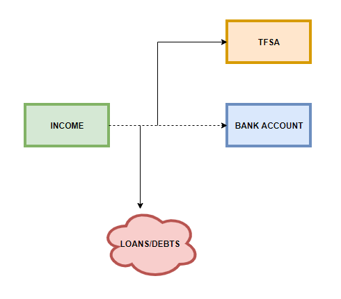

<blockquote>"Money is what drives the world for better or for worse." - Chamath Palihapitiya</blockquote>

An important topic that school should have been taught in detail. Now that the colder months are coming, it’s time to sit down and reflect the things I’ve learned about personal finance and actually apply it to my situation.

I decided to educate myself about how money works and what to do with it and become financially responsible.

During the summer, I dedicated a few months reading the following books:

- A Millionaire Teacher - Andrew Hallman

- I Will Teach You to Be Rich - Rami Sethi

- Common sense Investing - John C Bogle

I've learned how to manage my money, optimize my credit cards, understand the fundamentals of the stock market and the basics of investing. The books provided easy to read material for anyone who is starting their financial journey. I highly recommend you read the first two books before you read the third.

To keep it short, the take away from the books are as follows:

1. **Pay off any remaining debt/loans (for me this was OSAP)**

2) **Start saving (max out your TFSA/RRSP)**

3) **Take advantage of the employer match**

4) **Invest in the market - mainly index funds**

Step 1 and 2 are simple, pay off any remaining debts or loans.

For these steps, I personally used Ramit Sethi’s strategy. It is to have the money **_move on its own_** so you don’t have to deal with it. By setting up the accounts to do the work for me, I’m already halfway through the battle by paying off loans/debts and maxing out my TFSA.

When money is moving by itself, I am **_passively_** paying off the debts/loans and contributing to my TFSA. It will make sure that I won’t touch any money that could have been used effectively towards these goals. If I never see the amount taken away from me, then it won’t feel as bad because its like it was never even there.

The money is split by percentages, I wanted to have my loans paid as fast as I could - I know I could have done this differently but getting rid of my debt would be a huge stepping stone.  I dedicated 30% of my monthly income to my loans. 40% to my TFSA and 30% to my bank account for expenses.

I know what my monthly contribution will be towards my loans and I can roughly estimate the end date of when they will be paid off. Having a **clear deadline** for your goals are important.

Since I’ve already did my research, I have summarized it in this post [here](/money-making-money).

Disclaimer: I'm not a financial adviser, all of my post are for educational purposes only and should not be taken as financial advice.
