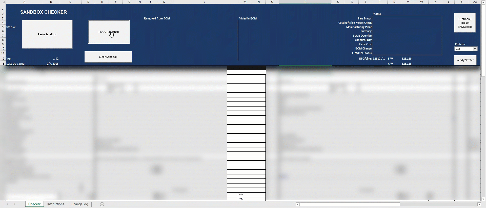

_Disclaimer: I do not reveal any sensitive and confidential material that is tied to my employer. My post is about my experience with Visual Basic and how I used it to solve a problem. It is for educational and informational purposes only._

As part of my job, I cost out the Bill of Materials (BOM) from OEMs by reviewing 3D data and using a PLM system. When I finish building the BOM in the PLM system, I send it to my technical manager to check.

#### 
**Problem**

The PLM system fails to do preliminary checks; all it knows is how to hold data. No prompts are shown when there are errors and the user interface is very hard on the eyes for spot checking.

When I saw my technical manager use a ruler to guide his eyes on the monitor to check horizontal lines to compare the old and new BOM, I automatically thought there has to be a better way.

I had my fair share of making errors when I first started work. As I was learning the job, my work would have to be sent back to fix because I missed small details. I eventually started brainstorm on how to fix this part of the issue when battling with my PLM system. My solution was to externally export the data to excel, then it would be in my playground and I’ll be free to do whatever I want to it.

#### 
**Solution**

I took the idea home and built the macros from excel using online resources. My previous experience in Python and Dr.Racket helped me transition to VB. All I did was Google the functions I needed and how Excel and VB worked together.

I’ve posted the my main code [here](https://github.com/kxdang/Excel-Macros-Checker). Again all of these are excel cell references and have no connection to any sensitive data by my employer. It shows how I referenced certain cells and how I used it to compare data. The main functions that were used:

1. For Loops to check every BOM data in every cell in Excel by going through its data

2) If-Else statements syntax to execute functions

3. How to create buttons in excel to execute my functions

4) How to compare cells with their data types

5. How to colour code excel lines to trigger a visual cue and show the user that there is an error

6) How to show pop up dialog to let user know tasks have been completed and allow them to interact with the dialog

7. Automate sending emails to my technical manager to let him know its ready

It took me about 2 hours to create a working excel based software. I learned to refactor the code because it had functions nested in If statements which eventually turned the software checks to be slow. To solve this, I separated functions and called separately. The checks are now instantaneous.

I learned how to store the code in the excel modules, this separates the code from the actual worksheet themselves so that they are publicly stored and prevent any issues when transferring the workbook to my teammates.

When doing tons of quotes, we get tired and eventually under perform from time to time. However, computers never get tired, they’re just lines of codes that constantly do the same thing when programmed correctly. I found that to be extremely powerful. Not only has this streamlined my work, but it also gives me 100% confidence that I won’t find any trivial issues.

I've also been improving many different business units with excel by using VLOOKUPs, nested IF statements, TRIM functions to find specific words and also recording macros to do repetitive tasks. I found ways for other business units to automate their spreadsheets. I made feasibility request by having excel automatically send emails to the appropriate person and even have excel files save with a name that is a standard format to our company. Reducing the number of repetitive typing saves a lot of wasted time.

All of my improvements have been submitted in our system as **Kaizens** which is the Japanese word for improvements. They refer to activities or ideas that continuously improve all functions and is used heavily in the Toyota Production System and many other lean manufacturers.

As my co-worker said, where there are inefficiencies, there are opportunities. There are always ways to improve existing processes and those are challenges I like to take.
