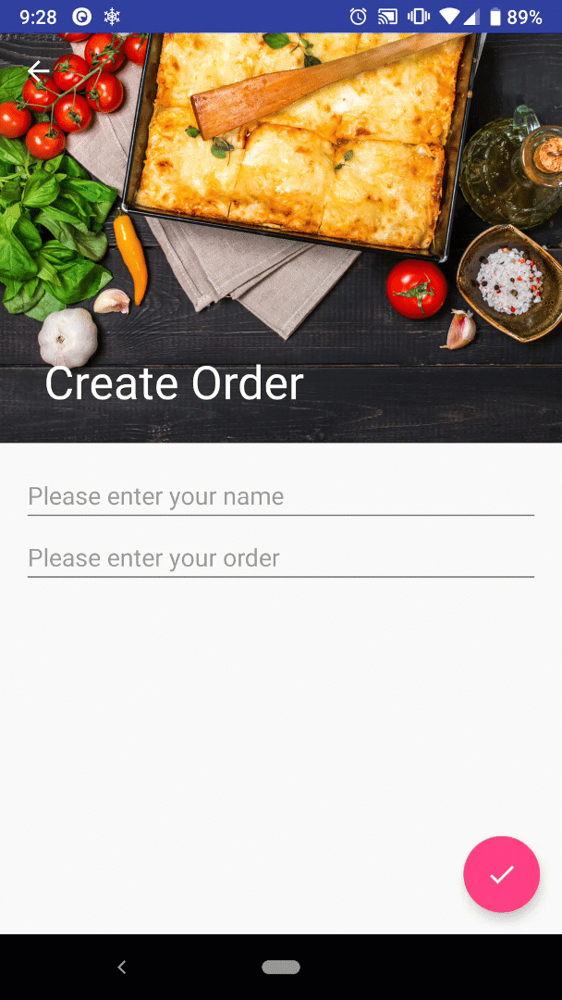

In this short exercise, I'll be adding the FAB and Snackbar.



FAB is short for **f**loating **a**ction **b**ar which allows engage a floating button to promote an action.

First we need to add the icon to our project to display the FAB. The best free resources for default icons is provided from Google.

The checkmark icon is called “done” which is found on the [Material Design website](https://material.io/tools/icons/?style=baseline). To install this, you will need to add folders to your app/src/main/res and call them the following:

1. drawable-hdpi

- drawable-mdpi
- drawable-xhdpi
- drawable-xxhdpi
- drawable-xxxhdpi

When the icon is downloaded, it will have these subfolders and you will need to add them individually. The reason why this exist is because devices have different DPIs and Google has provided an easy way to let the device set the correct DPI setting for its screen, meaning low DPI icons won’t be shown in high DPI devices which will appear blurry.

The code to add a floating action button for the XML is:

```xml
    <android.support.design.widget.CoordinatorLayout…>
    …
    <android.support.design.widget.FloatingActionButton
       android:layout_width="wrap_content"
       android:layout_height="wrap_content"
       android:layout_gravity="end|bottom"
       android:layout_margin="16dp"
       android:src="@drawable/ic_done_white_24dp"
       android:onClick="onClickDone"/>

    ...
    </android.support.design.widget.CoordinatorLayout>
```

A snackbar is similar to a toast but the user can engage with it. It can display a short message and an action item . For this to appear, you must implement the Snackbar.make() method and it takes 3 parameters.

1. View - the view ID that you want it to show in

2) Text - the message you want to appear

3. Int - duration of the snackbar

The snackbar object also contains a method called `setAction()` which allows the user to undo an action. The code snippet is below for the snackbar method and setAction.

```java
    public void onClickDone(View view) {
       CharSequence text = "Your order has been updated";
       int duration = Snackbar.LENGTH_SHORT;
       Snackbar snackbar = Snackbar.make(findViewById(R.id.coordinator), text, duration);

    // setAction allows you to Undo an action this is the code below
       snackbar.setAction("Undo", new View.OnClickListener() {
          @Override
          public void onClick(View view) {
              Toast toast = Toast.makeText(OrderActivity.this, "Undone!", Toast.LENGTH_SHORT);
              toast.show();
          }
       });
       snackbar.show();
    }
```
