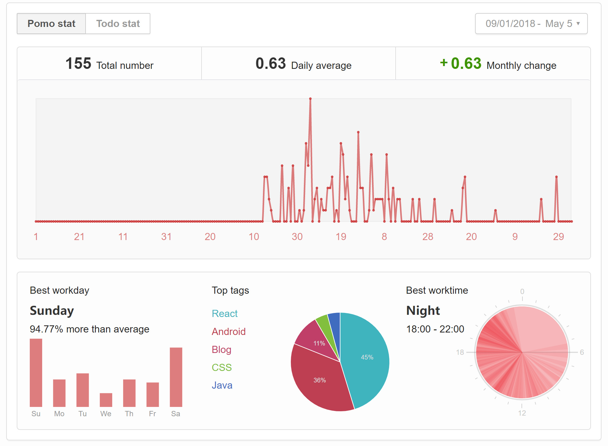

First day of unemployment. I have no idea what lies ahead of me but I do know where I want to be and how to get there.

Having a full-time job and programming on the side was difficult, however, I did manage to get farther than I thought I would using the [Pomodoro Technique](/pomodoro-technique/). My progress was tracked using the <a href="https://pomotodo.com" target="_blank">Pomotodo</a> tracker from Sept 1st 2018 to May 3rd 2019:

Looking back, I explored Java through Android development which was about a total of 700 pages of Head First Android. I'm proud to say that I can make a simple Android application with the built in SQL database. React was also explored during my time with Android with some small projects on my Github.

My productivity was never the highest during the weekday which was to be expected due to work. As you can see I've been most productive during weekends. I learned a lot about myself and my own energy level through this exercise.

Now with more free time I'll be able to develop projects from what I've learned. I told myself I’d give myself a good week to relax and enjoy the beautiful start of spring. This will be the first summer since 2012 that I have off.

Hopefully this won’t be too much as I have set myself a soft deadline for theory. I’m focusing heavily on the algorithms and data structures because I know this knowledge is required for the technical interviews. As someone who has no experience in any algorithm questions, I will be using the courses offered by MIT and Princeton University to develop the foundation.

I plan on gaining the skills I need to be employable in the tech industry. I feel will be the most difficult part would be standing out in front of many who have Computer Engineering and Computer Science degree with entry level positions under their belt.

I'm hoping my hard work, willingness to learn and determination will set me apart.

**Programming (First 20 days):**

- freeCodeCamp Responsive Web Design Certification (HTML, CSS)

- freeCodeCamp JavaScript Algorithms and Data Structures Certification (JS)

**Theory - Coursework (70 days):**

- <a href="https://ocw.mit.edu/courses/electrical-engineering-and-computer-science/6-006-introduction-to-algorithms-fall-2011/index.htm" target="_blank">Intro to Algorithms MIT Course</a>

- Princeton University course [Part 1](https://www.coursera.org/learn/algorithms-part1) and [Part 2](https://www.coursera.org/learn/algorithms-part2?) for Algorithms

- Java Object Oriented Programming from <a href="http://moocfi.github.io/courses/2013/programming-part-1/material.html" target="_blank">moocfi</a>

- Thinking in Java for Object Oriented Programming (Book Supplement)

**Projects (parallel to coursework - ongoing):**

- Create personal Android Application (Android SDK, Java)

- Recreate Android mobile app into ReactJS (React and Redux)

- Biochemistry Toolbox Website (React and Redux) - *idea*

I will continue to post my progress on where I’ve been. I like to keep track of my journey and maybe one day look back to see where I started and how far I've come.
