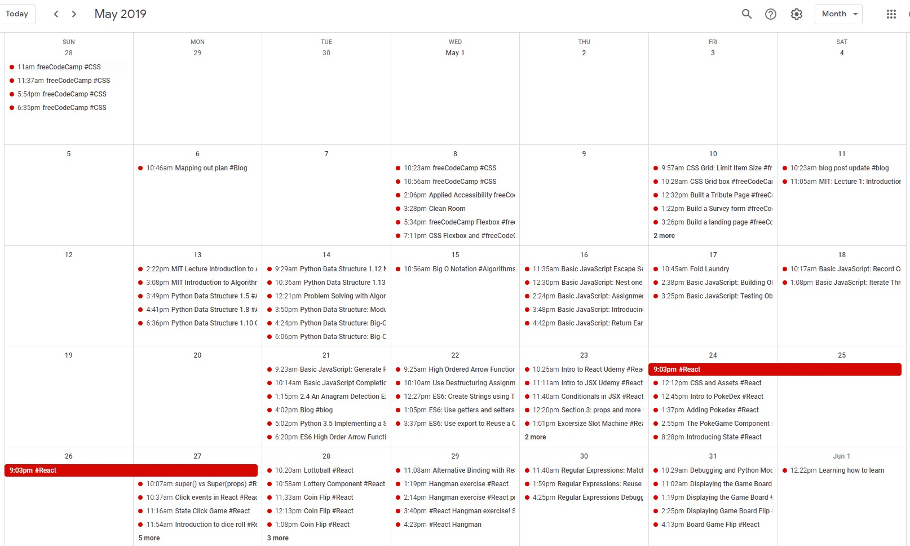
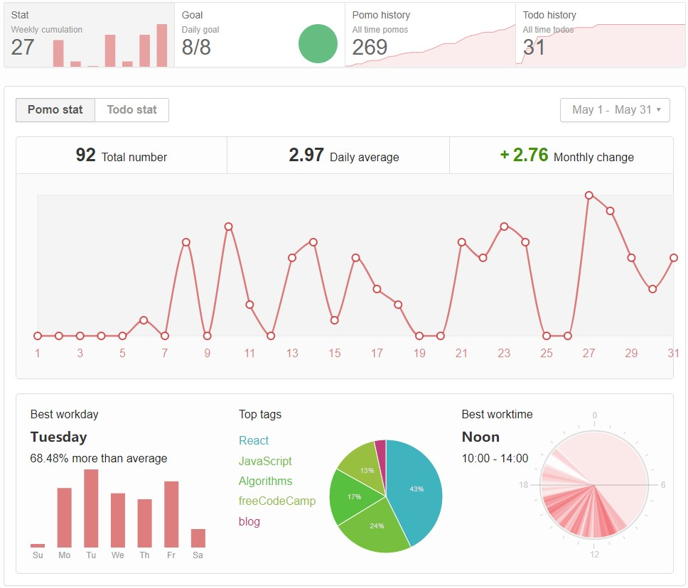

Concentration is a skill that takes time to develop; we live in an era where everything competes for our attention. The internet is a space where distractions are endless and to make matters worse, our personal phones keep us connected by alerting us for emails, social media and other miscellaneous apps. The [Pomodoro technique](/pomodoro-technique/) can be used to increase your concentration skills and help stay productive.

The simple and effective concept of 25 minutes of focus and 5 minute break. I remember struggling with 25 minutes of focus when I was in school. Studying was boring, I couldn’t sit still for 10 minutes because I was easily distracted with Facebook, games and other mundane things on the internet. Eventually, I became better at concentrating by working my way up, I would increase the focus time by 5 minutes starting at 10 until I was able to do one pomodoro.

## **Pomodoros help mimic a due date.**

If you’ve ever procrastinated before, you definitely know the feeling of urgency to complete something before it's due. Getting started is probably the hardest thing to do and pomodoros help create a sense of urgency to complete a task within 25 minutes. Most of the time, once you start working, you get into a state of **flow** (in the zone).

<blockquote>Flow is characterized by complete absorption in what one does and a resulting loss in one's sense of space and time.</blockquote>

You are most productive in a state of flow and pomodoros are meant to capitalize this state. There will be times where you work past the 25 minutes, which is completely normal and when you are stuck then that would be the ideal time to take your 5 minute break.

## **Pomodoro as a unit of measure for productivity.**

Tracking productivity can be tricky, however, with pomodoros, you know they are only 25 minute time blocks which are allocated for a particular task. If you do not finish the task within 25 minutes, then you can always try another pomodoro. Do not get caught up in the idea that if it is not completed in 25 minutes, then you have been unproductive. The most important thing is that you have spent 25 minutes putting in the effort to a particular task or problem.

Sometimes you might hear others putting “_endless_” hours trying to do a task or solve a problem, but then they don’t realize how many interruptions they’ve had and maybe it only took them 30 minutes of real work to complete something. Pomodoros allow you to quantify your efforts because you are blocking all interruptions during this time and you know those efforts were meaningful.

I’ve been using pomodoros to keep track of my studying and how many hours I’m using to actively learn a new topic. During May, I wanted to see my progress and track them as I go along and I found some valuable information about myself.

# 
**Self Reflection**

Below is a snapshot of my tracked Pomodoros last month, I left my full-time job on the first Friday of May.

There was a total of 92 pomodoros, equivalent to 38 hours last month and that was split between my React course, learning about algorithms and from freeCodeCamp. The pomodoros are now on full effect compared to what I had before with a full-time.

Previously, with a full-time job, weekends were the only times I really did any programming work, but now the difference is literally night and day as seen above and below respectively (best work time from night to noon - pun intended).

I found that I’m extremely productive in early mornings. During the afternoon, my brain starts to get sluggish, from around 2 pm to 3 pm is when my productivity decreases significantly and I start to lose focus. My goal was to hit 8 pomodoros every day, but when I first started, I was only able to hit 4/8 on most days. To combat sluggishness, I would jog around this time to [increase my energy levels](/managing-energy/) and to enjoy the beautiful summer weather.

During the last 2 weeks of May, I was able to hit 6/8 without any issues as my “mental stamina” became much better with practice and routine. Early this month, I’ve hit my 8 pomodoro goal multiple times and I feel like this is the progress I’ve been satisfied with.

Although the hours are not as crazy as the 8 hours per day that comes with a full-time job, I could honestly say that nobody has the energy and capacity to work the 8 hours every day at 100% efficiency and productivity. Based on my experience, a working full-time person would be at 75% productivity on average due to urgent email requests, meetings and other external interruptions that occur at a job.

That gives us about 30 hours on average of working time from a full-time job which equates to 5 hours per day not including 1-hour lunch. My 8 pomodoros hit 3.3 hours which is 1.7 hours shy of a full-time job. My goal is to be consistent and be able to spend my time developing skills to pursue my passion for programming and improve other aspects of my life through self-learning.
